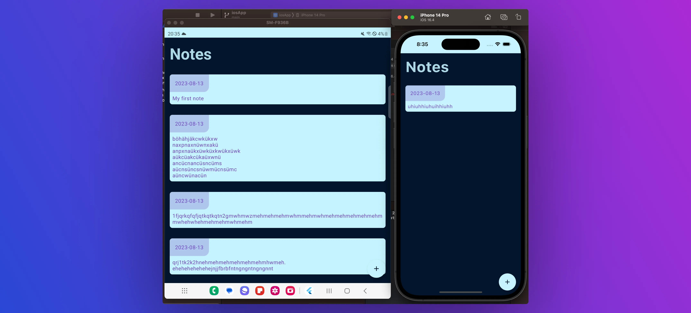

# Kotlin Multiplatform X Compose Multiplatform Notes Demo App

 
    

This project is a demo app for **Kotlin Multiplatform** in combination 
with **Compose Multiplatform**. 

It is a simple note taking app that contains a screen with a list of notes and a screen to add a new note.

To learn more, check out my article series on [Medium](https://medium.com/tech-takeaways/create-your-first-fully-cross-platform-mobile-app-with-compose-multiplatform-1-4-introduction-df16bd59d106).